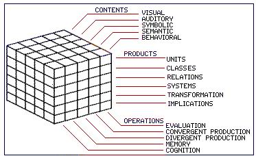

#20220531_Weekly report
+ [1.上周计划](上周计划)
+ [2.论文笔记](论文笔记)
+ [3.总结思考](总结思考)

##上周计划
* **阅读文献**：贡喆, 刘昌, 沈汪兵. 有关创造力测量的一些思考[J]. 心理科学进展, 2016, 24(1): 31.

##论文笔记
##### 创造力概念
 * **新颖性（originality）**：新颖、独特（创造性思维和产品应相对于 创造者自身或创新环境而言具有新颖、独特的品质）
 * **适宜性（appropriateness）**：有用性、有价值（创造性思维和产品对 创造者自身或问题情境具备“有用性” (useful)或 是对创新环境“有价值” (valuable)。）
 * 创造力是指个体产生出新颖且实用的想法、产品和服务等。（Amabile，1996）

##### 主流创造力测量方法
###### 发散思维测验（南加利福利亚大学发散思维测验）
   * **发散思维**：一种思维方式，为一个问题提出多种创造性的解决方案。
   * **基本理论假设**：创造力水平高的个体相较于普通人, 最显著的特点在于他们能够从多角度思考并解决问题。因此, 通过开发性问题评定个体发散思维水平, 就能够预测个体创造力潜能。
   * **形式**：开放性问题，被试根据问题罗列答案。
   * **创造力衡量角度**
    * 流畅性：单位时间内发散项目的数量。
    * 变通性：发散项目的范围或维度，范围越大，维度越多，变通性越好。
    * 独创性：产生不同寻常、独特新颖的见解。

   * **测验内容**
     * 给普通物品设计多种新颖用法。
     * 设想某种虚拟条件下 可能产生的新颖结果。
     * ...
   * **经典发散思维测验**
     * **Guilford（1967）智力结构测验**
     Guilford提出了智力的三维结构模型，他认为智力结构应从操作、内容、产物三个维度去考虑，智力活动就是人在头脑里加工（即操作过程）客观对象（即内容），产生知识（产物）的过程。
     
     * **Torrance（1972）托兰斯创造力测验（TTCT）**
       * 言语创造性思维测验
       * 图画创造性思维测验
       * 声音创造性思维测验 
   * **发散思维测验计分方法**
     * 经典计分方法
       * 计分方法
         **流畅性**：清点被试答案个数。
         **变通性**：计算被试答案囊括的不同种类。
         **独特性**：研究者将所有答案汇总, 如果某个答案是特殊的, 即唯一的, 那么该答案计1分, 其他答案记0分；列出一张非独特性答案对照表, 如果被试答案不在该表上, 即可以在独特性维度上计分；给样本中少于5%的答案记1分, 给其它答案记0分。
       * 经典计分方法存在的不足
         * 流畅性和独特性分数间相关过高, 二者的含义会因此发生混淆。
         * 独特性分数极易受到样本量误差的干扰。一个可以预见的情况是, 在一项发散思维测验里, 如果实验只有30个样本, 那么被试的很多答案都可能被认定为“特殊”, 但当样本扩充到300个乃至更多时, 原先“特殊”的答案可能将只是一个普通答案。
         * 对答案独特性的判定需要同时考量其是否合理, 因为创造力还内在具有适宜性的含义。依照传统计分方法, 一些古怪、奇特的答案很可能被纳入独特性得分的范畴。
     * 主观计分方法
       * 计分方法：要求被试在限时发散思维任务中给出有创意的答案, 并要求评定者依照不寻常、远距离以及聪明三个指标, 对被试给出的答案在5点量表上打分
       * 优点
         * 流畅性和独特性指标间不再混淆。 多项研究表明采用主观计分法后流畅性和独特性相关程度显著减小。
         * 独特性水平直接由评定者判定, 因此独特性分数不再受到样本量的干扰。
     * 快照评定方法：快照评定法只需要评定者对被试某道题目的答案进行整体评判, 而不需要对被试的每一个答案进行打分。
   * **发散思维测验不足**
    * **新颖性**：个体能够对某问题从多角度进行思考和解答, 未必是创造性思维新颖性的体现, 反映的可能只 是个体在长时记忆中存储的与该问题相关的信息数量。
    * **适宜性**：个体从多角度思考问题也不意味其思维具有适宜性。例如，创造力与精神质(psychoticism)存在显著正相关, 原 因可能在于他们在应用发散思维测验时并没有考 虑适宜性维度。

###### 顿悟类测验
* **基本理论假设**
  * 创造性思维还具备通过无意识自动联想, 解决界定模糊任务的能力(Mednick, 1962)。某问题界定模糊意味着, 解决该问题的方法和途径不明确, 此时个体需要借助一系列认知加工实现对问题的解决, 并继而产生顿悟的“啊哈”体验。
  * 高创造性个体能够凭借诸如:远距离联想、思维重组、原型启发等认知加工过程整合并处理与目标有关的信息, 从而更好的解决顿悟问题, 并产生顿悟体验。
* **经典顿悟类测验：远距离联想测验（RAT）**
  * **理论**
    * 创造性思考是将联想得到来的元素重新整合的过程。新结合的元素之间联想的距离越远，这个思维的过程或问题的解决就更有创造力。
    * 有创造力的人的联想不同于一般人，有创造力的人有广泛的联想，一个元素可以与许多其他元素连接，而一般人元素连接比较少，广泛的联想支持遥远的、原创的、令人意外的元素整合。
  * **RAT测验的实施**：受测者被告知将会看见三个词汇，然后他们尝试产生第四个词使它与前面三个词都能组成词组。

###### 创造力成就测验
* **基本理论假设**：如果有什么能够预测未来的创造力潜能, 那 么最有可能的是已经存在的创造力成就。
* **测量方式**
  *  可证实的成就或荣誉的数量。
  * 已存在的创造性产品所获得的评价。
  * 自述创造力成就清单（主流）。

###### **同感评估技术**（重点关注）
* **基本理论假设**：某领域内的专家对该领域创造力评估存在一种共识。因此, 当评价某产品的创造力水平时, 只需要借助该领域专家业已形成的 标准对产品进行评定即可。
* **基本要求**：
  *  测验评定者需为该领域专家。
  *  评定者依靠其对创造力的内隐态度对产品进行评判。
  *  评定者应独立对产品进行评估。
* **使非专家在特定类型的研究或产品中可以胜任：**Cropley 和 Kaufman (2012) 编制了创造性解决方案诊断量表(creative solution diagnosis scale)。该量表包括 30 个项目, 每一个 项目对应一个评价维度, 要求评定者根据项目对该产品在该维度上的水平进行打分。他们的研究发现, 当施用该量表对产品创造性水平进行评价时, 即使评定者为非专家, 评价结果仍具备较高的内部一致性系数。但值得注意的问题是, 在使用该量表时, 评定者的评价标准实际上直接受到了该量表明确、外显标准的引导, 这与 Amabile (1982)强调评定者个体凭借内隐态度进行评判的理念已经背道而驰, 与同感评估技术基本理论要求形成矛盾。

 | Kind of criterion | Quantitative criteria |Qualitative  criteria|
|--------|--------|--------|
|  External      | differs strongly from what already exists ;   generates substantial surprise;  is highly generalizable; provides new leads on existing issues (is seminal); reveals new issues (is germinal)|relevant;valuable;effective;useful|
|Internal|generates many ideas;leads to substantial reformulation of ideas;opens up new principles| logical;elegant;understandable;well-crafted;harmonious;complex|
* **典型**：在西方5种创造力主流学术期刊中, 约1/4的创造力测量方法采取了同感评估技术或类似的专家评价方法(Long, 2014)。
* **评定者效应**
  * 表层效应为评定者给出的原始分数，潜层效应为评定者的思维过程和评定认知。
  * 有关:评定者背景、知识经验以及内心准则；创造性产品作者的性别以及名字特殊性的影响；文化差异

##总结思考
* 四种主流的创造力测量方法对于创造力的定义都不太相同，目前比较公认的定义是新颖性（originality）以及适宜性（appropriateness）。
* 从远距离联想测验（RAT）中得到了一点点启发：有创造力的人的联想不同于一般人，有创造力的人有广泛的联想，一个元素可以与许多其他元素连接，而一般人元素连接比较少，广泛的联想支持遥远的、原创的、令人意外的元素整合。对于学术论文的创造力可以从一点出发考虑。
* 学术论文的创造力的评分大多采用同感评估技术，即由某领域内的专家对该领域创造力进行评估，每个领域对于创造力的定义都不相同，领域内专家会通过自己的认知、常年来积累的经验对论文的创造力进行评估。