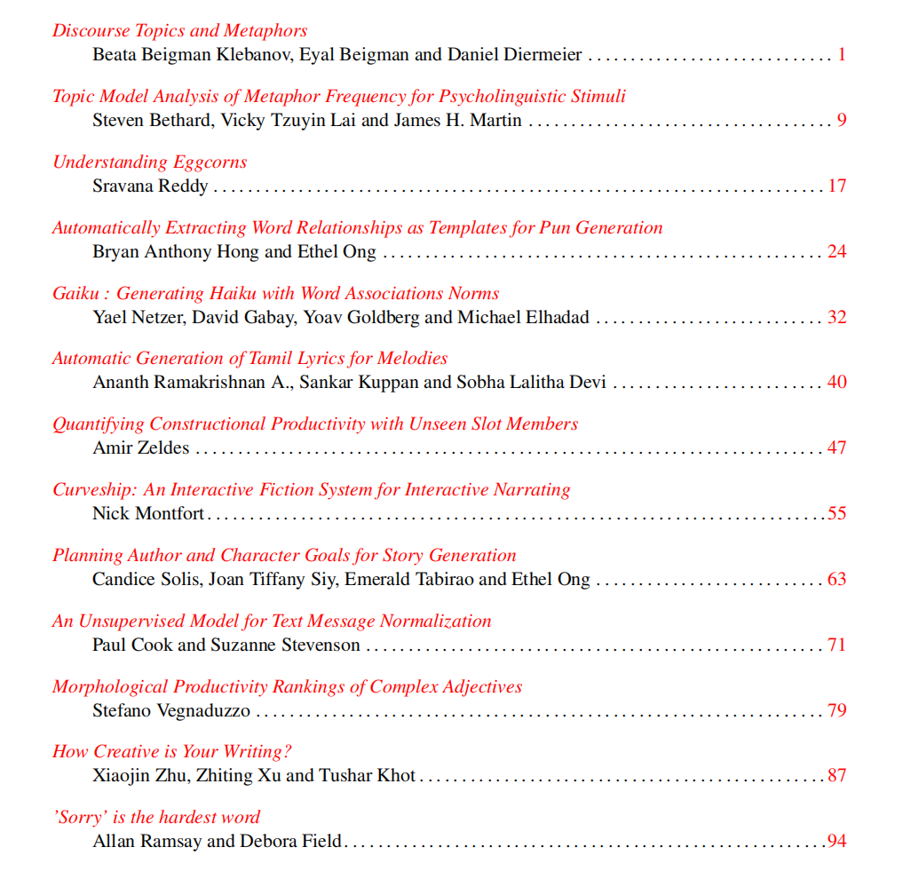
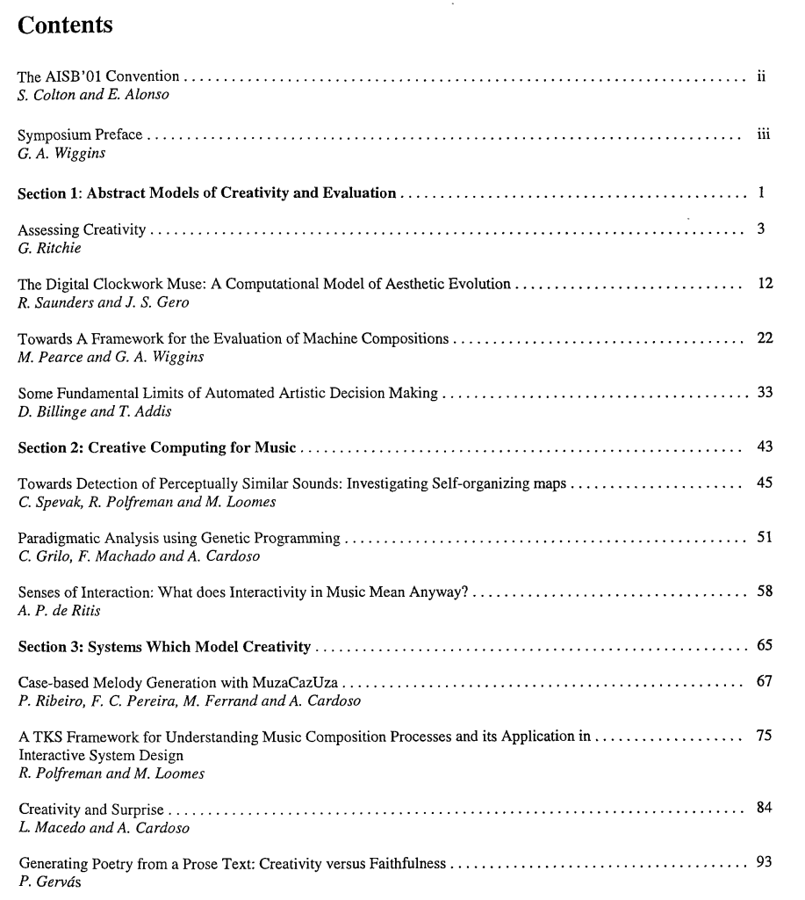

# 20220624_Weekly report
+ [1.上周反馈](上周反馈)
+ [2.收集资料](收集资料)
+ [3.下周计划](下周计划)

### 上周反馈
* Proceedings of the Workshop on Computational Approaches to Linguistic Creativity（计算方法和语言创造性）整理里面的文章。
* Proceedings of the AISB01 Symposium on artificial intelligence and creativity in arts and science整理里面的文章
* 以后要读的文章：
  * Küfner A C P, Back M D, Nestler S, et al. **Tell me a story and I will tell you who you are! Lens model analyses of personality and creative writing**[J]. Journal of Research in Personality, 2010, 44(4): 427-435.
  * Boyd N. **A creative writing research methodology: New directions, strange loops and tornados**[C]//Margins and Mainstreams: Refereed conference papers of the 14th Annual AAWP Conference. 2009.
* 一篇新的文章，围绕这个的参考文献和被引用，收集相关扩展的新文献
   * Zedelius C M, Mills C, Schooler J W. **Beyond subjective judgments: Predicting evaluations of creative writing from computational linguistic features**[J]. Behavior Research Methods, 2019, 51(2): 879-894. 
* **查找文献方法**：看关于creativity writing文章的作者，如果一个人名总出现，那这个人的研究团队，也是需要关注的。

* * *

### 收集资料
* **Proceedings of the Workshop on Computational Approaches to Linguistic Creativity（计算方法和语言创造性）**

* * *

* **Proceedings of the AISB01 Symposium on artificial intelligence and creativity in arts and science**

* * *

* Zedelius C M, Mills C, Schooler J W. **Beyond subjective judgments: Predicting evaluations of creative writing from computational linguistic features**[J]. Behavior Research Methods, 2019, 51(2): 879-894. 相关文献
  * **摘要**：如何在创意写作的背景下评估创造力的问题一直是一个持续讨论的主题。一个关键问题是，能否以超越主观判断的系统方式评估像创造力这样难以捉摸的事物。为了回答这个问题，我们测试了人类对短篇小说创造力的评价是否可以通过以下方式来预测：（1）已建立的创造力测量方法和（2）故事的计算机语言分析。我们进行了两项研究，其中大学生（有或没有创意写作的兴趣和经验）根据写作提示写短篇小说。独立评估者（研究 1 中有 6 人，研究 2 中有 5 人）使用专门设计用于评估创造力方面的评估标准来评估故事，他们在评估者之间表现出很高的可靠性。我们提供了收敛效度的证据，因为量规评估与已建立的创造力测量相关，包括发散性思维、联想流畅性和自我报告的创造性行为和成就的测量。短篇小说的语言特性使用两种计算机文本分析工具进行分析：Coh-Metrix，它分析文本凝聚力和可读性的各个方面，以及语言查询和字数，它识别文本内容的有意义的心理类别。语言特征在很大程度上预测了人类对创造力的评价。这些结果提供了新的证据，证明创意写作可以被可靠地、系统地评估，以捕捉文本的客观特征。结果进一步确立了我们的评估标准作为评估创意写作的有用工具。
  * Amabile, T. M. (1983a). **The social psychology of creativity**. New York, NY: Springer.
  * Amabile, T. M. (1983b). **The social psychology of creativity: A componential conceptualization.** Journal of Personality and Social Psychology, 45, 357–376. https://doi.org/10.1037/0022-3514.45.2.357
  * Amabile, T. M. (1996). **Creativity in context.** Boulder, CO: Westview Press.
  * Baer, J., & Kaufman, J. C. (2005). **Bridging generality and specificity: The amusement park theoretical (APT) model of creativity.** Roeper Review, 27, 158–163.
  * Barron, F. (1955). **The disposition toward originality**. Journal of Abnormal and Social Psychology, 51, 478–485.
  * Benedek, M., & Neubauer, A. C. (2013). **Revisiting Mednick's model on creativity-related differences in associative hierarchies. Evidence for a common path to uncommon thought**. Journal of Creative Behavior, 47, 273–289.
  * Blomer, Y. (2011). **Assessment in creative writing**. Wascana Review, 43, 61–73.
  * Crossley, S. A., & McNamara, D. S. (2011a). **Text coherence and judgments of essay quality: Models of quality and coherence**. In L. Carlson, C. Hölscher, & T. F. Shipley (Eds.), Expanding the space of cognitive science: Proceedings of the 33rd Annual Meeting of the Cognitive Science Society (pp. 1236–1241). Austin, TX: Cognitive Science Society.
  * Crossley, S. A., & McNamara, D. S. (2011b). **Understanding expert ratings of essay quality: Coh-Metrix analyses of first and second language writing**. International Journal of Continuing Engineering Education and Life Long Learning, 21, 170–191.
  * Crossley, S. A., & McNamara, D. S. (2012). **Predicting second language writing proficiency: The roles of cohesion and linguistic sophistication.** Journal of Research in Reading, 35, 115–135.
  * Crossley, S. A., Roscoe, R. D., & McNamara, D. S. (2011). **Predicting human scores of essay quality using computational indices of linguistic and textual features**. In G. Biswas, S. Bull, J. Kay, & A. Mitrovic (Eds.), Proceedings of the 15th International Conference on Artificial Intelligence in Education (pp. 438–440). Berlin, Germany: Springer.
  * Dollinger, S. J. (2003). **Need for uniqueness, need for cognition, and creativity**. Journal of Creative Behavior, 37, 99–116.
  * Gabora, L. (2010). **Revenge of the “neurds”: Characterizing creative thought in terms of the structure and dynamics of memory**. Creativity Research Journal, 22, 1–13.
  * Gabora, L., O’Connor, B., & Ranjan, A. (2012). **The recognizability of individual creative styles within and across domains**. Psychology of Aesthetics, Creativity, and the Arts, 6, 351–360.
  * Graesser, A. C., McNamara, D. S., & Kulikowich, J. M. (2011). **Coh-Metrix: Providing multilevel analyses of text characteristics**. Educational Researcher, 40, 223–234.
  * Kantor, K. (1975). **Evaluating creative writing: A different ball game.** The English Journal, 64, 72–74.
  * Kaufman, J. C., Baer, J., & Cole, J. C. (2009). **Expertise, domains, and the consensual assessment technique**. Journal of Creative Behavior, 43, 223–233.
  * Kaufman, J. C., Baer, J., Cole, J. C., & Sexton, J. D. (2008).** A comparison of expert and nonexpert raters using the Consensual Assessment Technique**. Creativity Research Journal, 20, 171–178.
  * Kim, K., Lee, Y., & Lee, C. H. (2012). **College students’ style of language usage: Clues to creativity**. Perceptual and Motor Skills, 114, 43–50.
  * Mozaffari, H. (2013). **An analytical rubric for assessing creativity in creative writing**. Theory and Practice in Language Studies, 3, 2214–2219.
  * Newman, J. (2007). **The evaluation of creative writing at MA level (UK)**. In S. Earnshaw (Ed.), The handbook of creative writing (pp. 24–36). Edinburgh, UK: Edinburgh University Press.
  * Rezaei, A. R., & Lovorn, M. (2010).** Reliability and validity of rubrics for assessment through writing**. Assessing Writing, 15, 18–39.
  * Tausczik, Y. R., & Pennebaker, J. W. (2010). **The psychological meaning of words: LIWC and computerized text analysis methods**. Journal of Language and Social Psychology, 29, 24–54.

* * *

### 下周计划
* 整理找到的论文，阅读摘要，总结
